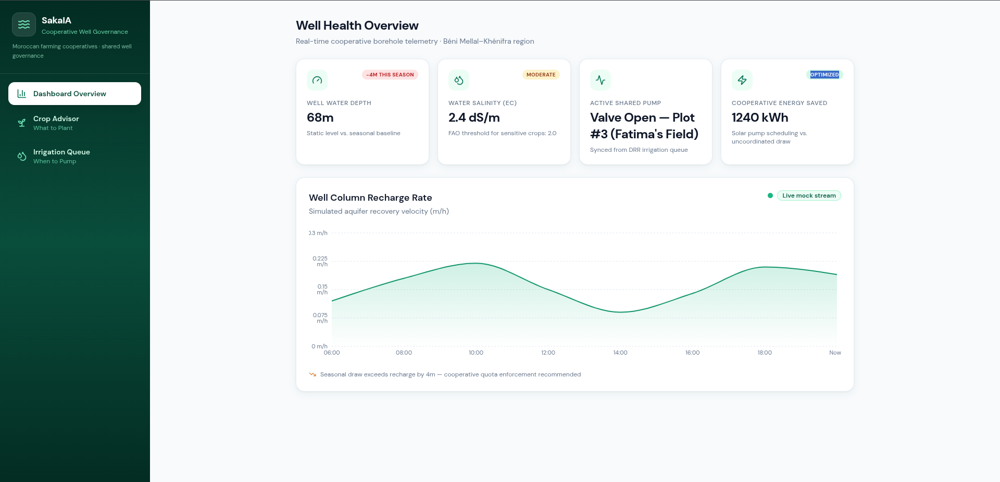

# SakaIA — Cooperative Well Governance Platform

> **Water-aware crop intelligence and borehole governance for Moroccan farming cooperatives (AUEA systems)**

SakaIA prevents groundwater well depletion and resolves community conflict over shared boreholes by matching crop selection to aquifer health and algorithmically scheduling pump access across cooperative members.

---

## Demo 
https://skaia-ten.vercel.app/

---




## Table of Contents

- [Project Overview](#project-overview)
- [The Problem](#the-problem)
- [The Solution](#the-solution)
- [Architecture](#architecture)
- [Features](#features)
- [Tech Stack](#tech-stack)
- [Getting Started](#getting-started)
- [Demo Flow](#demo-flow)
- [Data Model](#data-model)
- [Business Model](#business-model)
- [Unit Economics](#unit-economics)
- [Market Context](#market-context)
- [Roadmap](#roadmap)
- [License](#license)

---

## Project Overview

SakaIA (from Arabic *سقى* — "to water") is a standalone, water-aware agricultural intelligence platform built for Moroccan AUEA cooperatives — formal associations sharing a single groundwater borehole. The platform operates on two axes:

| Axis | Question answered | Module |
|---|---|---|
| **Crop Intelligence** | *What should I plant?* | Crop Advisor |
| **Well Governance** | *When can I pump?* | Irrigation Queue |

Both axes are anchored to real-time borehole telemetry displayed on the **Dashboard**, making SakaIA the first integrated solution for the crop–water–cooperative governance triangle in Morocco's over-extracted aquifer basins.

---

## The Problem

Morocco's three most agriculturally productive basins — **Souss-Massa**, **Haouz/Marrakech**, and **Tadla** — are experiencing sustained groundwater depletion at rates far exceeding aquifer recharge. The consequences are threefold:

1. **Aquifer over-extraction** — Static well levels drop 4–8m per season in many ORMVA perimeters. Cooperative boreholes shared by 4–12 farmers have no automated fairness mechanism; pump access is negotiated verbally and often results in conflict.

2. **Salinity intrusion** — As water tables fall, saline water migrates upward. Farmers planting salinity-sensitive crops (tomatoes, mint, some citrus varieties) experience partial or total yield loss without early warning.

3. **Energy waste** — Uncoordinated pumping — multiple valves open simultaneously, pumps running during low-recharge windows — wastes butane fuel and solar pump capacity at an estimated cost of 1,500–3,000 MAD per hectare per year.

SakaIA addresses all three failure modes with one integrated, low-cost platform.

---

## The Solution

### Hardware Layer (Physical MVP)
- **1× ESP32-WROOM gateway node** per hectare (IP67-rated enclosure, rated to 85°C)
- **3× daisy-chained soil moisture sensors** for root-zone deficit mapping across 10,000 m²
- **1× automated line valve** with actuator for remote and scheduled irrigation control
- **LoRa radio** for long-range, low-power data relay to the cooperative dashboard
- Total hardware cost: **500 MAD / hectare** (~$50 USD), including installation labor

### Software Layer (This Repository)
High-fidelity React prototype demonstrating the full cooperative governance flow — no backend required. All state is managed client-side with realistic mock data anchored to Souss-Massa field conditions.

---

## Architecture

```
src/
├── App.jsx                        # Root layout, tab routing, queue state injection
├── components/
│   ├── layout/
│   │   └── Sidebar.jsx            # Dark teal nav — Dashboard / Crop Advisor / Queue
│   ├── dashboard/
│   │   ├── DashboardOverview.jsx  # Well telemetry, energy savings, live chart
│   │   └── RechargeChart.jsx      # Recharts area chart with simulated live ticks
│   ├── crop/
│   │   └── CropAdvisor.jsx        # FAO-constrained agronomic matching UI
│   └── irrigation/
│       └── IrrigationQueue.jsx    # DRR fairness queue with 6h simulation
├── components/ui/
│   ├── MetricCard.jsx             # Reusable KPI card with icon + badge
│   └── StatusBadge.jsx            # Colour-coded pill badges (5 variants)
├── data/
│   └── mockData.js                # All mock constants: well depth, salinity, queue, crops
├── hooks/
│   └── useIrrigationQueue.js      # DRR algorithm state machine
└── index.css                      # Tailwind base + scrollbar utilities
```

---

## Features

### 📊 Dashboard Overview
- **Well depth telemetry** — static level vs. seasonal baseline with trend badge
- **Salinity monitoring** — live EC reading (dS/m) against FAO crop thresholds
- **Active pump status** — synced in real time from the irrigation queue state
- **Cooperative energy savings** — cumulative kWh saved through precision scheduling
- **Aquifer recharge chart** — animated area chart with simulated live tick every 4 seconds, showing m/h recovery velocity across the day

### 🌾 Crop Advisor
- **FAO-aligned agronomic matching engine** — ranks crops against current well salinity, soil type, and field size
- **Soil type selector** — Clay-Loam, Sandy, Silty (maps to water retention and infiltration rates)
- **Salinity presets** — Low (0.8 dS/m) / Medium (2.4 dS/m) / High (4.2 dS/m) EC presets with 1-second simulated engine latency
- **Ranked recommendations** — match percentage, agronomic rationale, and REJECTED flags for incompatible crops
- **Hectare slider** — scales field size from 0.5 to 20 Ha for cooperative-level planning

### 💧 Irrigation Queue (Deficit Round Robin)
- **DRR fairness algorithm** — allocates pump access by root-zone moisture deficit, not by seniority or social pressure
- **4-farmer cooperative demo** — Fatima, Amine, Karim, Youssef share a single borehole
- **Simulate 6 Hours Later** — advances the queue: active farmer's moisture recovers, valve closes, next-highest-deficit farmer activates
- **Live valve status** — animated pulse indicator on the currently pumping plot
- **Priority ranking** — Critical / High / Medium / Low badges re-rank automatically after each simulation step
- **Reset** — returns to initial state for repeated demo runs

---

## Tech Stack

| Layer | Technology |
|---|---|
| UI Framework | React 18 + Vite 6 |
| Styling | Tailwind CSS 3 with custom `saka` color palette |
| Charts | Recharts 2 (AreaChart with live state updates) |
| Icons | Lucide React |
| Font | DM Sans (Google Fonts) |
| State | React hooks only — no external store |
| Build | Vite (ESM, HMR) |
| Mock data | Local JS constants — no API calls |

The hardware prototype (not in this repo) runs on:

| Layer | Technology |
|---|---|
| Microcontroller | ESP32-WROOM-32 |
| Connectivity | LoRa 868 MHz (EU band) |
| Sensors | Capacitive soil moisture × 3 (daisy-chained I²C) |
| Valve control | 12V solenoid actuator via MOSFET relay |
| Enclosure | IP67 ABS, UV-stabilised, conformal-coated PCB |

---

## Getting Started

**Prerequisites:** Node.js ≥ 18

```bash
# Clone the repository
git clone https://github.com/ilyassouhsseine/sakaia.git
cd sakaia

# Install dependencies
npm install

# Start development server
npm run dev
```

Open the URL shown in the terminal — typically `http://localhost:5173`.

```bash
# Production build
npm run build

# Preview production build
npm run preview
```

No environment variables or backend configuration required. All data is mocked client-side.

---

## Demo Flow

The recommended 2-minute hackathon demo path:

### Step 1 — Dashboard (30s)
- Point out the **well depth** (68m, down 4m this season) and the **salinity EC** (2.4 dS/m, approaching the FAO sensitive-crop threshold of 2.0)
- Note the **energy savings counter** (1,240 kWh saved vs. uncoordinated draw)
- Watch the **recharge chart** tick live — note the midday dip when pump load is highest

### Step 2 — Crop Advisor (45s)
- Set Soil Type to **Clay-Loam**, Salinity to **Medium** (2.4 dS/m), field size to **3.5 Ha**
- Click **Run Agronomic Matching Engine**
- Show results: Quinoa (94% match, salinity-tolerant), Olives (88% match, low water demand), Mint (REJECTED — exceeds well quota)
- Key message: *"SakaIA tells farmers what to plant before they plant it — not after the crop fails."*

### Step 3 — Irrigation Queue (45s)
- Show the initial state: **Fatima's plot is critical** (14% soil moisture), valve open and pumping
- Click **Simulate 6 Hours Later** — Fatima's moisture recovers to 46%, valve closes, **Amine** (next highest deficit at 28%) takes the slot
- Click again — Amine finishes, **Karim** activates
- Key message: *"No arguments at the borehole. The algorithm decides. Everyone gets a fair turn based on actual root-zone need."*

---

## Data Model

### Well Telemetry (`mockData.js`)

```js
WELL_DEPTH_M      // number — current static level in metres
WELL_DEPTH_TREND  // string — seasonal delta label
SALINITY_EC       // number — electrical conductivity in dS/m
ENERGY_SAVED_KWH  // number — cumulative cooperative energy savings
RECHARGE_SERIES   // array  — { time: string, rate: number (m/h) }
```

### Irrigation Queue Entry

```js
{
  plotId:       number,   // unique plot identifier
  farmer:       string,   // farmer name (displayed in UI)
  soilMoisture: number,   // root-zone moisture 0–100%
  deficit:      number,   // DRR effective deficit score (higher = more urgent)
  priority:     'critical' | 'high' | 'medium' | 'low',
  status:       'active' | 'next' | 'waiting',
  valveOpen:    boolean   // physical valve state
}
```

### Crop Recommendation Entry

```js
{
  rank:   number,
  name:   string,
  match:  number,   // 0–100 agronomic compatibility score
  status: 'recommended' | 'rejected',
  reason: string    // agronomic rationale shown in UI
}
```

---

## Business Model

SakaIA operates on a four-tier revenue structure designed for the Moroccan cooperative institutional context. All billing targets the **AUEA treasurer** — a legally registered officer — not individual smallholders.

| Tier | Model | Price | Notes |
|---|---|---|---|
| **A — Hardware** | One-time sale or 12-month lease | 500 MAD/Ha or 50 MAD/Ha/mo | Lease recovers CapEx through SaaS billing cycle |
| **B — SaaS** | Annual subscription per AUEA | 200–300 MAD/Ha/yr | Dashboard, alerts, queue scheduling, ORMVA reporting |
| **C — Value-share** | % of verified water savings | 5–8% of audited delta | Year 2+ upsell; validated by ORMVA water-meter readings |
| **D — Institutional API** | B2G licensing | Negotiated per basin | Aggregated aquifer health data for ORMVAs, ABHSM, OCP Africa |

**Collection infrastructure:** Al Barid Bank Agri + CIH Agri mobile banking rails; post-harvest lump-sum billing aligned to crop payment cycles.

---

## Unit Economics

| Metric | Value |
|---|---|
| CapEx per hectare | 500 MAD (~$50 USD) |
| Annual energy savings | 1,500 MAD/Ha/yr |
| Payback period (energy only) | **~4 months** |
| 3-year IRR (energy only) | **~280%** |
| Yield protection value | 30,000–55,000 MAD/Ha/yr |
| Probability-weighted annual value | 9,600–15,100 MAD/Ha/yr |
| SaaS subscription | 200–300 MAD/Ha/yr |
| Subscription as % of yield floor | **< 1%** |

The SaaS subscription cost is recovered in under two weeks of normal operation — making churn an anomaly, not a planning assumption.

---

## Market Context

| Segment | Hectares | Revenue potential |
|---|---|---|
| **TAM** — All groundwater-irrigated Morocco | ~1,000,000 Ha | 700M MAD hardware + 200M MAD/yr SaaS |
| **SAM** — Souss-Massa, Haouz, Tadla stressed basins | ~400,000 Ha | 296M MAD hardware + 80M MAD/yr SaaS |
| **SOM** — Mid-sized AUEAs, Years 1–3 | 8,000–15,000 Ha | 1.9M–3.6M MAD/yr SaaS |

Priority basins are those with active **PGRE** (Plan de Gestion des Ressources en Eau) quota enforcement — ORMVA regulatory pressure creates institutional pull for adoption.

Target crops by basin:

- **Souss-Massa** — export citrus, greenhouse tomatoes, avocado (highest protection value)
- **Haouz/Marrakech** — olive groves, rose crops, market vegetables
- **Tadla** — sugar beet, citrus, market vegetables

---

## Roadmap

### Phase 1 — Prototype (current)
- [x] High-fidelity React prototype with full cooperative governance flow
- [x] DRR fairness queue simulation
- [x] FAO-aligned crop matching engine (mock)
- [x] Live recharge chart with animated telemetry
- [x] Hardware MVP assembled (ESP32 + 3-sensor array + valve)

### Phase 2 — Pilot (3–6 months)
- [ ] Real ESP32 firmware with LoRa data relay to cloud MQTT broker
- [ ] Live sensor data integration replacing mock constants
- [ ] WhatsApp Business API integration for Darija-language pump alerts
- [ ] ORMVA PGRE compliance export module

### Phase 3 — Scale (6–18 months)
- [ ] AUEA onboarding portal with CIH Agri / Al Barid Bank payment integration
- [ ] Basin-level aquifer aggregation dashboard (Tier D institutional API)
- [ ] OCP Africa and ORMVA Souss-Massa partnership deployment
- [ ] Multi-borehole cooperative support (AUEA federations)

---

## License

MIT License — Copyright © 2026 Ilyass Ouhsseine

See [LICENSE](./LICENSE) for full terms.