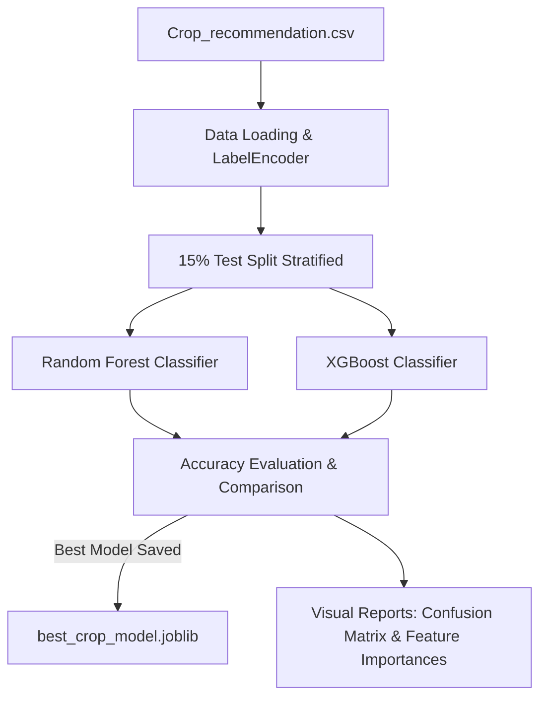

# Smart Crop Recommendation System 🌱

An end-to-end, high-accuracy Machine Learning pipeline designed to recommend the optimal crop for cultivation based on specific chemical soil profiles and environmental weather readings.

Utilizing **Random Forest** and **XGBoost** classification models, the pipeline achieves an outstanding **99.39% accuracy** on a stratified **15% validation split**.

---

## 📊 Dataset & Features

The system trains on soil parameters and weather conditions to suggest one of 22 different crop classes (e.g., *Rice, Maize, Chickpea, Kidneybeans, Pigeonpeas, Mothbeans, Mungbean, Blackgram, Lentil, Pomegranate, Banana, Mango, Grapes, Watermelon, Muskmelon, Apple, Orange, Papaya, Coconut, Cotton, Jute, Coffee*).

### Input Features:
* **`N`**: Nitrogen content ratio in soil (kg/ha)
* **`P`**: Phosphorus content ratio in soil (kg/ha)
* **`K`**: Potassium content ratio in soil (kg/ha)
* **`ph`**: pH value of the soil (0.0 to 14.0 scale)
* **`temperature`**: Ambient temperature (°C)
* **`humidity`**: Relative humidity (%)
* **`rainfall`**: Average rainfall (mm)

---

## 🛠️ Pipeline Architecture



---

## 📦 Requirements & Installation

Make sure you have Python 3.8+ installed. You can install all required dependencies via pip:

```bash
pip install pandas numpy scikit-learn xgboost matplotlib seaborn joblib
```

---

## 🚀 Usage Guide

### 1. Train and Evaluate the Model
To start the pipeline and generate the model and visualization files, run the training script:
```bash
python api.py
```
**What happens under the hood:**
1. Loads the soil data and encodes string target labels (0-21).
2. Performs a stratified **15% train-test split**.
3. Trains both Random Forest and XGBoost classifiers.
4. Identifies the winner (both models achieve **99.39% accuracy**!).
5. Saves the winning classifier and label encoder together to `best_crop_model.joblib`.
6. Saves `confusion_matrix.png` and `feature_importance.png` in the directory.

---

### 2. Predict Crops for New Soil Samples
We provided a prediction utility to run inference on new soil or climate readings.

#### Run Demo Prediction
Runs prediction on a typical rice cultivation sample dataset entry:
```bash
python predict.py
```

#### Run Custom Prediction
Pass raw parameter measurements directly in the terminal command using this signature:
```bash
python predict.py <N> <P> <K> <pH> <temperature> <rainfall> <humidity>
```

*Example (predicting for soil with $N=85, P=58, K=41, pH=7.0, temp=21.8^\circ C, rain=226.7mm, humidity=80.3\%$):*
```bash
python predict.py 85 58 41 7.0 21.8 226.7 80.3
```

**Output:**
```text
=======================================================
  CROP PREDICTION RESULTS (Model: Random Forest)
=======================================================
Inputs:
  - Nitrogen (N):    85.0 kg/ha
  - Phosphorus (P):  58.0 kg/ha
  - Potassium (K):   41.0 kg/ha
  - soil pH value:   7.00
  - Temperature:    21.80 °C
  - Humidity:       80.30 %
  - Rainfall:       226.70 mm
-------------------------------------------------------
[Rank 1] Primary Crop Recommended: RICE (100.00% confidence)

Top 3 Crop Recommendations:
  [1st] Rice            : 100.00% confidence
  [2nd] Watermelon      : 0.00% confidence
  [3rd] Banana          : 0.00% confidence
=======================================================
```

---

### 3. Serve Model as Web API (FastAPI)
We implemented a production-grade Web API in `app.py`. You can start the server and run requests from any HTTP client (like Python requests, Curl, Postman, or frontend Javascript engines).

#### Start API Server
```bash
python app.py
```
This will launch a live local web server on `http://127.0.0.1:8000`.

#### Interactive Swagger UI Documentation
Open your web browser and navigate to:
```text
http://127.0.0.1:8000/docs
```
This gives you a beautifully formatted interactive portal to view API specifications and run tests!

#### Sample Request (POST `/predict`)
Send a JSON payload with soil characteristics:
```bash
curl -X POST "http://127.0.0.1:8000/predict" \
     -H "Content-Type: application/json" \
     -d '{
       "N": 90.0,
       "P": 42.0,
       "K": 43.0,
       "ph": 6.5,
       "temperature": 20.87,
       "humidity": 82.0,
       "rainfall": 202.93
     }'
```

#### Sample Response
```json
{
  "success": true,
  "primary_recommendation": "rice",
  "confidence": 0.9667
}
```

---

## 📈 Visual Reports & Metric Artifacts

After running the training script, two primary artifacts are generated in the project workspace:
1. **`confusion_matrix.png`**: Displays a detailed heatmap of prediction vs actual validation labels for all 22 classes.
2. **`feature_importance.png`**: Illustrates which environmental and chemical variables are most critical for deciding crop recommendations (e.g., Rainfall, Humidity).
